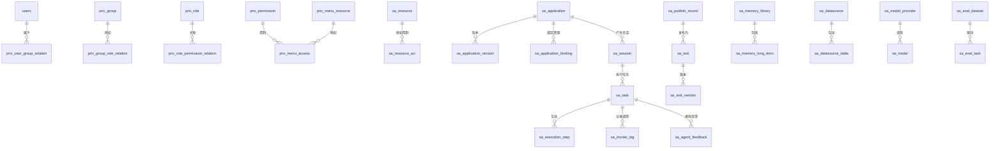
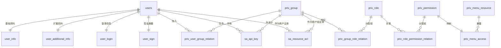
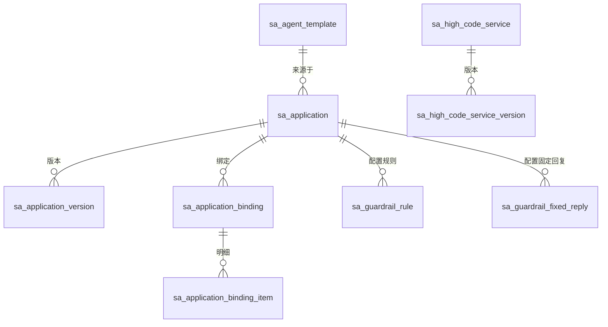
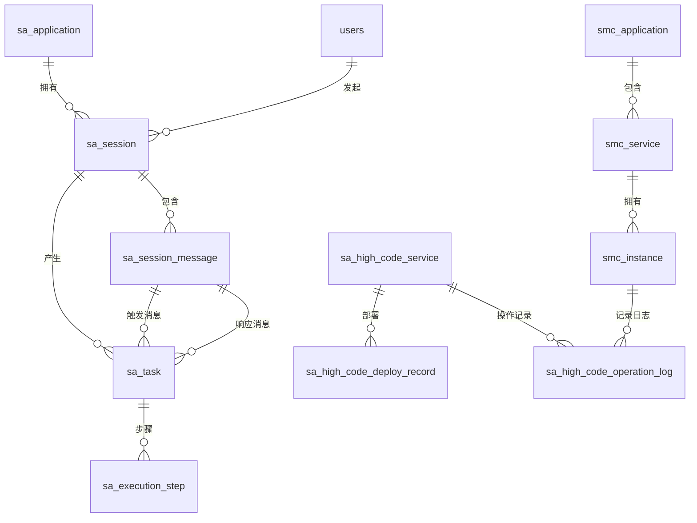
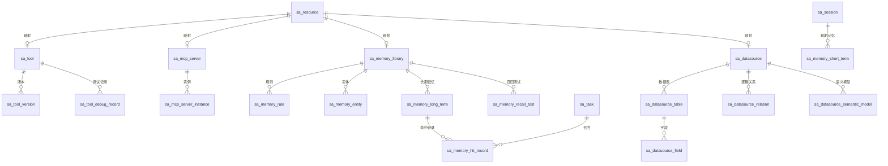
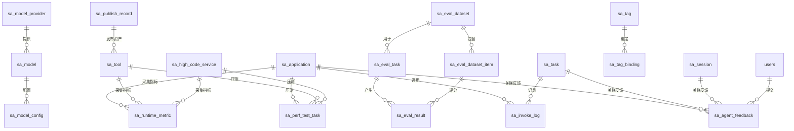

# 数据库ER图

本文档基于 [数据库详细设计表.md](E:/java/workplace/spring-ai-alibaba/.claude/sophicAgent/数据库详细设计表.md) 整理，按领域输出数据库 ER 图，ER 图统一使用 Mermaid 表达。

## 1. 总体说明

系统数据库主要分为以下 5 个领域：

- 账号权限域
- 应用与设计器域
- 运行时域
- 能力资产域
- 治理观测与运营域

整体主干关系如下：



## 2. 账号权限域

### 2.1 领域说明

账号权限域负责平台身份管理、用户扩展资料、用户组角色权限控制，以及资源授权主体管理。

### 2.2 关键实体

- `users`
- `user_info`
- `user_additional_info`
- `user_login`
- `user_sign`
- `priv_group`
- `priv_role`
- `priv_permission`
- `priv_menu_resource`
- `priv_menu_access`
- `priv_group_role_relation`
- `priv_role_permission_relation`
- `priv_user_group_relation`
- `sa_api_key`
- `sa_resource_acl`

### 2.3 ER 图



### 2.4 关系说明

- `users` 为用户主实体。
- `user_info`、`user_additional_info`、`user_login`、`user_sign` 围绕 `users` 扩展。
- `priv_user_group_relation` 表示用户与用户组的多对多关系。
- `priv_group_role_relation` 表示用户组与角色的多对多关系。
- `priv_role_permission_relation` 表示角色与权限点的多对多关系。
- `priv_menu_access` 表示权限点到菜单资源的映射关系。
- `sa_api_key` 表示用户或用户组维度的 API 凭证关系。
- `sa_resource_acl` 表示资源与授权主体之间的访问控制关系。

## 3. 应用与设计器域

### 3.1 领域说明

应用与设计器域负责智能体、工作流、高代码服务的定义、版本管理、能力挂载和规则配置。

### 3.2 关键实体

- `sa_agent_template`
- `sa_application`
- `sa_application_version`
- `sa_application_binding`
- `sa_application_binding_item`
- `sa_high_code_service`
- `sa_high_code_service_version`
- `sa_guardrail_rule`
- `sa_guardrail_fixed_reply`

### 3.3 ER 图



### 3.4 关系说明

- `sa_agent_template` 表示应用模板来源。
- `sa_application` 表示应用主实体，承载智能体或工作流定义。
- `sa_application_version` 表示应用版本快照实体。
- `sa_application_binding` 表示应用版本与资源之间的绑定关系。
- `sa_application_binding_item` 表示绑定资源内部的明细项关系。
- `sa_guardrail_rule` 表示应用规则干预配置。
- `sa_guardrail_fixed_reply` 表示应用固定回复配置。
- `sa_high_code_service` 与 `sa_high_code_service_version` 表示高代码服务及其版本关系。

## 4. 运行时域

### 4.1 领域说明

运行时域负责会话、消息、执行任务、步骤留痕，以及高代码服务部署和运行控制。

### 4.2 关键实体

- `sa_session`
- `sa_session_message`
- `sa_task`
- `sa_execution_step`
- `sa_high_code_deploy_record`
- `sa_high_code_operation_log`
- `smc_application`
- `smc_service`
- `smc_instance`

### 4.3 ER 图



### 4.4 关系说明

- `sa_session` 表示用户在某应用下的一次会话。
- `sa_session_message` 表示会话中的消息流。
- `sa_task` 表示单轮执行任务。
- `sa_execution_step` 表示任务执行过程中的步骤明细。
- `sa_high_code_deploy_record` 表示高代码服务版本的部署记录。
- `sa_high_code_operation_log` 表示高代码服务与实例维度的操作日志关系。
- `smc_application`、`smc_service`、`smc_instance` 表示运行服务平台中的应用、服务与实例关系。

## 5. 能力资产域

### 5.1 领域说明

能力资产域负责平台可复用能力的资产化管理，包括工具、MCP、记忆、数据源等。

### 5.2 关键实体

- `sa_resource`
- `sa_tool`
- `sa_tool_version`
- `sa_tool_debug_record`
- `sa_mcp_server`
- `sa_mcp_server_instance`
- `sa_memory_short_term`
- `sa_memory_library`
- `sa_memory_rule`
- `sa_memory_long_term`
- `sa_memory_hit_record`
- `sa_memory_entity`
- `sa_memory_recall_test`
- `sa_datasource`
- `sa_datasource_table`
- `sa_datasource_field`
- `sa_datasource_relation`
- `sa_datasource_semantic_model`

### 5.3 ER 图



### 5.4 关系说明

- `sa_resource` 表示统一资源注册中心。
- `sa_tool` 表示平台工具主表。
- `sa_tool_version` 表示工具版本关系。
- `sa_tool_debug_record` 表示工具调试记录关系。
- `sa_mcp_server` 与 `sa_mcp_server_instance` 表示 MCP 服务与实例关系。
- `sa_memory_short_term` 表示会话短期记忆。
- `sa_memory_library` 向规则、实体、长期记忆和召回测试延伸。
- `sa_memory_hit_record` 表示记忆命中与任务之间的关联。
- `sa_datasource` 向表、字段、逻辑关系、语义模型延伸。

## 6. 治理观测与运营域

### 6.1 领域说明

治理观测与运营域负责模型治理、调用日志、指标采集、反馈、标签、发布、评测和压测。

### 6.2 关键实体

- `sa_model_provider`
- `sa_model`
- `sa_model_config`
- `sa_invoke_log`
- `sa_runtime_metric`
- `sa_agent_feedback`
- `sa_tag`
- `sa_tag_binding`
- `sa_publish_record`
- `sa_eval_dataset`
- `sa_eval_dataset_item`
- `sa_eval_task`
- `sa_eval_result`
- `sa_perf_test_task`

### 6.3 ER 图



### 6.4 关系说明

- `sa_model_provider`、`sa_model`、`sa_model_config` 表示模型治理主链关系。
- `sa_invoke_log` 表示任务执行过程中的调用日志关系。
- `sa_runtime_metric` 表示目标对象的运行指标采集关系。
- `sa_agent_feedback` 表示应用、任务、会话和用户之间的反馈关系。
- `sa_tag` 与 `sa_tag_binding` 表示通用标签体系。
- `sa_publish_record` 表示资产发布历史关系。
- `sa_eval_dataset`、`sa_eval_dataset_item`、`sa_eval_task`、`sa_eval_result` 表示评测闭环关系。
- `sa_perf_test_task` 表示应用、工具、高代码服务的性能压测任务关系。

## 7. 跨域主链路

### 7.1 应用构建链

```text
sa_agent_template
  -> sa_application
  -> sa_application_version
  -> sa_application_binding
  -> sa_application_binding_item
```

### 7.2 应用运行链

```text
users
  -> sa_session
  -> sa_session_message
  -> sa_task
  -> sa_execution_step / sa_invoke_log
```

### 7.3 资源授权链

```text
sa_resource
  -> sa_resource_acl
  -> users / priv_group
```

### 7.4 资产沉淀链

```text
sa_application_version
  -> sa_publish_record
  -> sa_tool
  -> sa_tool_version
```

### 7.5 评测治理链

```text
sa_eval_dataset
  -> sa_eval_dataset_item
  -> sa_eval_task
  -> sa_eval_result
```

## 8. 总结

从 ER 结构看，系统有 5 个中心实体：

- `users`：身份中心
- `sa_resource`：资源授权中心
- `sa_application`：业务编排中心
- `sa_task`：运行追踪中心
- `sa_publish_record`：资产沉淀中心

整套设计体现为“账号权限 + 资源中心 + 应用设计器 + 运行时 + 资产治理”的统一平台模型。
