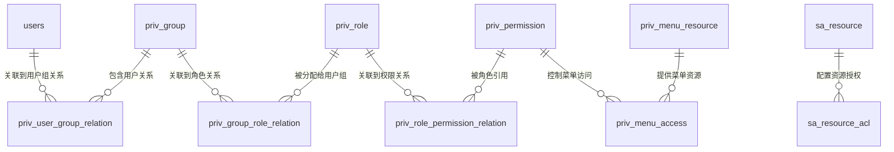
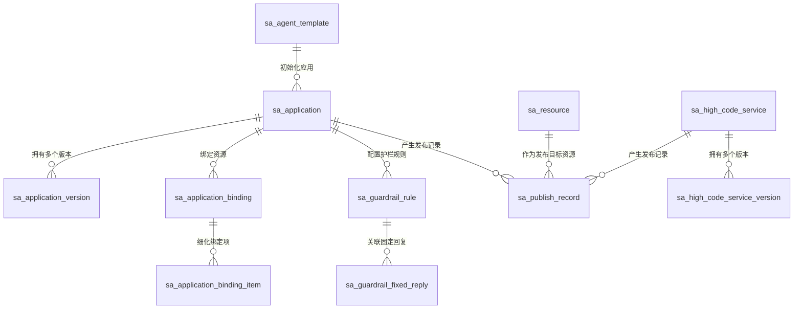
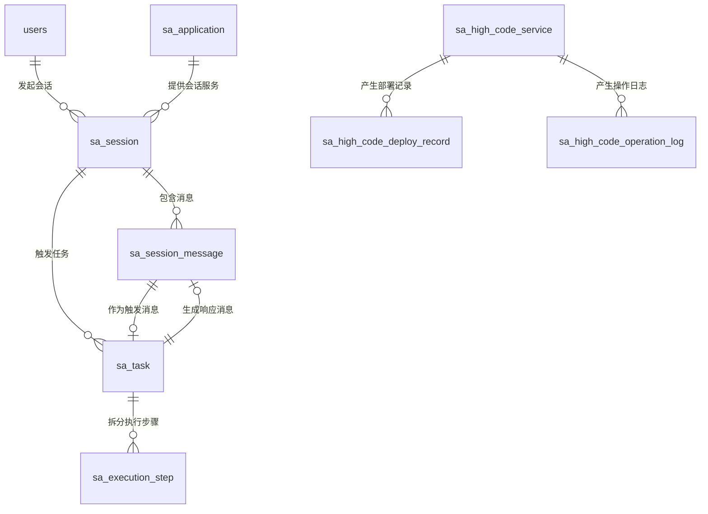
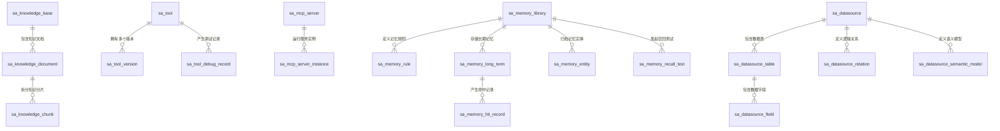
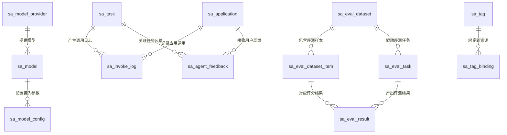

# SophicAgent 数据库结构设计

## 1. 文档说明

本文基于以下文档整理形成统一数据库结构设计：

- `.claude/sophicAgent/sophicAgent数据库设计_V1_V2.md`
- `.claude/sophicAgent/数据库表明细.md`
- `.claude/agentSophic功能设计.md`

设计目标是将 SophicAgent 的业务对象、关系模型和落库约束统一到一个可实施的数据库结构方案中，覆盖概念结构设计、逻辑结构设计、物理结构设计，并用 E-R 图描述核心表关系。

## 2. 设计原则

- 主键统一采用 `id bigint unsigned auto_increment`。
- 新增表默认采用“自增物理主键 + 业务 ID/业务编码”方案。
- 业务主键统一采用 `xxx_id`、`xxx_code`、`version` 组合建模。
- 主业务实体表使用 `xxx_id` 作为业务唯一标识，必要时补充 `xxx_code` 作为可读编码。
- 业务层表关联优先使用业务标识，不直接对外暴露自增 `id`。
- 纯关系表、中间表、统计事实表不强制增加业务 UUID，可通过组合唯一约束或组合索引表达业务唯一性。
- 既有存量表保持现状，不因新增规范统一而强制改造主键类型。
- 状态统一采用 `status`，启停类控制补充 `enabled`。
- 时间字段统一采用 `gmt_create`、`gmt_modified`，运行态补充 `gmt_start`、`gmt_end`、`gmt_last_active`。
- 配置快照、DSL、规则、元数据等非结构化内容优先采用 `json`、`text`、`longtext`。
- 资源权限统一通过 `sa_resource` + `sa_resource_acl` 建模，不在业务表重复设计 ACL。
- 标签统一通过 `sa_tag` + `sa_tag_binding` 建模，不在资源表内冗余 `tags` 字段。
- 工作流 V1 采用“版本快照存储”模式，工作流节点、边、画布配置统一进入 `sa_application_version.config_snapshot`。
- 已有账号权限域和运行管理域表继续复用，不重复设计同类基础模型。

## 3. 概念结构设计

### 3.1 概念域划分

SophicAgent 数据库从业务上划分为五个概念域：

1. 账号权限域
   - 负责用户、组、角色、权限点、菜单权限和资源 ACL。
   - 核心对象：用户、用户组、角色、权限、资源、授权规则、API Key。
2. 应用与设计器域
   - 负责智能体、工作流、高代码服务、模板、版本、组件绑定、护栏规则。
   - 核心对象：应用、应用版本、模板、结构定义、组件绑定、发布对象。
3. 运行时域
   - 负责会话、消息、任务、执行步骤、高代码部署与操作记录。
   - 核心对象：会话、消息、任务、执行轨迹、部署记录、实例操作。
4. 能力资产域
   - 负责知识库、工具、MCP 服务、记忆库、数据源等可复用能力资产。
   - 核心对象：知识库、文档、分片、工具、MCP 服务、记忆库、数据源语义模型。
5. 治理观测与运营域
   - 负责模型接入、调用日志、运行指标、反馈、发布、评测、压测、标签。
   - 核心对象：模型供应商、模型、调用日志、运行指标、评测集、评测任务、发布记录。

### 3.2 核心业务实体

#### 账号与权限实体

- 用户：平台登录主体，来源于既有 `users` 体系。
- 用户组：资源授权和角色归属主体。
- 角色：功能权限集合。
- 权限点：菜单访问和接口能力控制单元。
- 资源：SophicAgent 内需要授权的统一业务对象。
- 资源 ACL：资源的读写授权记录。

#### 应用设计实体

- 智能体模板：新建应用时的初始化蓝本。
- 应用：智能体、工作流的统一业务主体。
- 应用版本：应用在不同生命周期下的配置快照。
- 应用绑定：应用挂载的能力组件。
- 应用绑定项：对绑定资源中具体项的细粒度选择。
- 高代码服务：以 Java/Python 形式实现的服务能力。
- 护栏规则/固定回复：应用的输入输出干预配置。

#### 运行时实体

- 会话：用户和应用之间的持续对话上下文。
- 会话消息：会话中的消息记录。
- 任务：单轮输入触发的一次执行实例。
- 执行步骤：任务内部逐步执行过程。
- 部署记录：高代码服务部署流水。
- 操作日志：高代码服务运行控制流水。

#### 能力资产实体

- 知识库、知识文档、知识分片：RAG 资产结构。
- 工具、工具版本、工具调试记录：可复用工具能力。
- MCP 服务、MCP 服务实例：外部工具协议接入能力。
- 记忆库、记忆规则、长期记忆、命中记录、记忆实体、召回测试：长期记忆体系。
- 数据源、数据表、数据字段、逻辑关系、语义模型：面向问数与数据分析的结构化资产。

#### 治理运营实体

- 模型供应商、模型、模型配置：模型接入与运行配置。
- 调用日志、运行指标：监控审计数据。
- 用户反馈：运行结果回流。
- 发布记录：应用、工具、高代码的发布事实。
- 评测集、样本、评测任务、评测结果：效果评测体系。
- 压测任务：性能评估体系。
- 标签、标签绑定：分类与检索能力。

### 3.3 概念关系

- 一个用户可属于多个用户组，一个用户组可关联多个角色。
- 一个应用可有多个版本、多个绑定组件、多个护栏规则。
- 一个应用版本承载完整运行快照，是设计态与运行态的桥梁。
- 一个会话属于一个应用，一个会话包含多条消息，一条用户消息通常触发一个任务。
- 一个任务包含多个执行步骤，并可衍生多条调用日志、反馈记录、记忆命中记录。
- 一个知识库包含多个文档，一个文档包含多个知识分片。
- 一个记忆库包含多条记忆规则和多条长期记忆记录。
- 一个数据源包含多张表，每张表包含多个字段，并通过逻辑关系表定义跨表关系。
- 一个发布记录对应一个版本事实，可把应用或高代码服务发布为应用或工具。

## 4. 逻辑结构设计

### 4.1 逻辑分层

| 逻辑层 | 说明 | 代表表 |
|---|---|---|
| 基础身份层 | 用户、组织、角色、权限、菜单 | `users`、`priv_group`、`priv_role`、`priv_permission` |
| 统一资源层 | 对业务对象进行统一注册与授权 | `sa_resource`、`sa_resource_acl` |
| 设计态定义层 | 模板、应用、版本、绑定、规则 | `sa_agent_template`、`sa_application`、`sa_application_version`、`sa_application_binding` |
| 运行态执行层 | 会话、消息、任务、执行步骤、运行日志 | `sa_session`、`sa_session_message`、`sa_task`、`sa_execution_step` |
| 能力资产层 | 知识、工具、MCP、记忆、数据源 | `sa_knowledge_base`、`sa_tool`、`sa_mcp_server`、`sa_memory_library`、`sa_datasource` |
| 治理运营层 | 模型、发布、反馈、评测、压测、指标 | `sa_model_provider`、`sa_publish_record`、`sa_eval_task`、`sa_runtime_metric` |

### 4.2 逻辑实体关系

#### 4.2.1 账号权限域

- `users` 通过 `priv_user_group_relation` 与 `priv_group` 建立多对多关系。
- `priv_group` 通过 `priv_group_role_relation` 与 `priv_role` 建立多对多关系。
- `priv_role` 通过 `priv_role_permission_relation` 与 `priv_permission` 建立多对多关系。
- `priv_permission` 通过 `priv_menu_access` 映射到 `priv_menu_resource`，实现菜单与按钮可见性控制。
- `sa_resource` 为应用、工具、知识库、数据源、MCP 服务、记忆库等提供统一资源锚点。
- `sa_resource_acl` 通过 `resource_id + subject_type + subject_id + permission_type` 实现资源级授权。

#### 4.2.2 应用与设计器域

- `sa_application` 是应用主实体，逻辑上包含 agent 与 workflow 两种类型。
- `sa_application_version` 通过 `agent_id + version` 记录应用每个版本的配置快照，并在 `type=agent` 时承载 `instruction`、`input_keys`、`output_key`、`handle_config`、`sub_agents`、`yaml_schema` 等 Agent 专属结构定义。
- `sa_application_binding` 记录应用绑定的资源类型和资源实例。
- `sa_application_binding_item` 记录绑定资源中的子项选择，如 MCP 工具、数据表、字段、概念等。
- `sa_guardrail_rule` 和 `sa_guardrail_fixed_reply` 作为应用配置的一部分，按应用维度关联。
- `sa_high_code_service` 与 `sa_high_code_service_version` 构成高代码服务的主从版本结构。

#### 4.2.3 运行时域

- `sa_session` 关联应用和用户，表示一个持续对话上下文。
- `sa_session_message` 归属于 `sa_session`，用 `seq_no` 表示消息顺序。
- `sa_task` 归属于会话，引用触发消息和响应消息，表示一次完整执行。
- `sa_execution_step` 归属于任务，记录执行过程中的具体步骤。
- `sa_high_code_deploy_record` 归属于高代码服务版本，记录部署事实。
- `sa_high_code_operation_log` 归属于高代码服务或实例，记录运行控制动作。

#### 4.2.4 能力资产域

- 知识资产采用 `知识库 -> 文档 -> 分片` 三层结构。
- 工具资产采用 `工具主表 -> 工具版本 -> 工具调试记录` 三层结构。
- MCP 采用 `服务主表 -> 服务实例` 两层结构。
- 长期记忆采用 `记忆库 -> 记忆规则 -> 记忆实体/记忆片段 -> 命中记录/召回测试` 结构。
- 数据源采用 `数据源 -> 表 -> 字段` 主从结构，并通过 `sa_datasource_relation` 补充逻辑外键，通过 `sa_datasource_semantic_model` 补充业务语义。

#### 4.2.5 治理观测与运营域

- 模型治理采用 `供应商 -> 模型 -> 模型配置` 三级结构。
- 发布治理采用 `sa_publish_record` 记录发布对象、版本、发布类型和目标资源。
- 反馈治理通过 `sa_agent_feedback` 回流到应用、任务和会话。
- 效果评测采用 `评测集 -> 评测样本 -> 评测任务 -> 评测结果` 结构。
- 性能评估通过 `sa_perf_test_task` 对应用、工具和高代码服务版本进行压测。
- 标签治理通过 `sa_tag` 和 `sa_tag_binding` 向多类资源提供标签能力。

### 4.3 关键逻辑约束

- 应用编码 `agent_code` 唯一，应用主标识 `agent_id` 唯一。
- 应用版本在 `agent_id + version` 维度唯一。
- 绑定关系建议在 `agent_id + agent_version + resource_type + resource_id` 维度唯一。
- 绑定项建议在 `binding_id + item_type + item_id` 维度唯一。
- 资源 ACL 建议在 `resource_id + subject_type + subject_id + permission_type` 维度唯一。
- 工具版本、高代码版本、模型配置、评测结果等均以“主实体业务主键 + 版本或子实体业务主键”确保唯一。
- 长期记忆、召回命中、调用日志等运行态事实表不建议建立过多强外键，避免高并发写入成本过高，可采用业务外键加索引控制。

## 5. 物理结构设计

### 5.1 存储选型

- 数据库建议采用 MySQL 8.0。
- 字符集建议采用 `utf8mb4`，排序规则建议采用 `utf8mb4_unicode_ci`。
- 存储引擎建议采用 InnoDB。
- 配置快照、DSL、复杂规则、上下文建议使用 `json` 或 `longtext`。
- 会话消息、执行步骤、调用日志、指标等高增长表建议按时间或业务维度预留分区/归档方案。

### 5.2 命名规范

- 表名统一采用 `sa_` 前缀，复用系统表保持原有命名。
- 主键统一为 `id bigint unsigned auto_increment`。
- 业务主键统一使用 `varchar(64)` 或 `varchar(100)` 作为逻辑标识。
- 对外接口、跨系统交换、权限控制、资源绑定统一使用业务主键，不直接使用自增 `id`。
- 主业务实体按需补充 `xxx_code`，用于展示、检索、导入导出和人工识别。
- 状态字段统一采用 `tinyint`。
- 是否启用统一采用 `tinyint`。
- JSON 快照字段统一以 `_snapshot`、`_config`、`metadata` 命名。

### 5.3 核心物理表分组

#### 5.3.1 账号权限域

| 表名 | 作用 | 主键/唯一建议 |
|---|---|---|
| `sa_api_key` | API 鉴权凭证 | PK:`id` UQ:`api_key` |
| `sa_resource` | 统一资源注册 | PK:`id` UQ:`resource_id` |
| `sa_resource_acl` | 资源级授权 | PK:`id` UQ:`resource_id,subject_type,subject_id,permission_type` |

#### 5.3.2 应用与设计器域

| 表名 | 作用 | 主键/唯一建议 |
|---|---|---|
| `sa_agent_template` | 智能体模板 | PK:`id` UQ:`template_id`,`template_code` |
| `sa_application` | 应用主表 | PK:`id` UQ:`agent_id`,`agent_code` |
| `sa_application_version` | 应用版本 | PK:`id` UQ:`agent_id,version` |
| `sa_application_binding` | 应用挂载资源 | PK:`id` UQ:`binding_id` |
| `sa_application_binding_item` | 挂载项明细 | PK:`id` |
| `sa_high_code_service` | 高代码服务主表 | PK:`id` UQ:`service_id`,`service_code` |
| `sa_high_code_service_version` | 高代码服务版本 | PK:`id` |
| `sa_guardrail_rule` | 护栏规则 | PK:`id` UQ:`rule_id` |
| `sa_guardrail_fixed_reply` | 固定回复 | PK:`id` UQ:`record_id` |

#### 5.3.3 运行时域

| 表名 | 作用 | 主键/唯一建议 |
|---|---|---|
| `sa_session` | 会话主表 | PK:`id` UQ:`session_id` |
| `sa_session_message` | 会话消息 | PK:`id` UQ:`message_id` |
| `sa_task` | 任务主表 | PK:`id` UQ:`task_id` |
| `sa_execution_step` | 执行步骤 | PK:`id` UQ:`step_id` |
| `sa_high_code_deploy_record` | 部署记录 | PK:`id` UQ:`deploy_id` |
| `sa_high_code_operation_log` | 操作日志 | PK:`id` UQ:`operation_id` |

#### 5.3.4 能力资产域

| 表名 | 作用 | 主键/唯一建议 |
|---|---|---|
| `sa_knowledge_base` | 知识库 | PK:`id` UQ:`knowledge_base_id` |
| `sa_knowledge_document` | 知识文档 | PK:`id` UQ:`document_id` |
| `sa_knowledge_chunk` | 知识分片 | PK:`id` UQ:`chunk_id` |
| `sa_tool` | 工具主表 | PK:`id` UQ:`tool_id`,`tool_code` |
| `sa_tool_version` | 工具版本 | PK:`id` UQ:`tool_version_id` |
| `sa_tool_debug_record` | 工具调试记录 | PK:`id` UQ:`debug_id` |
| `sa_mcp_server` | MCP 服务 | PK:`id` UQ:`server_code` |
| `sa_mcp_server_instance` | MCP 服务实例 | PK:`id` UQ:`instance_id` |
| `sa_memory_library` | 记忆库 | PK:`id` UQ:`memory_library_id`,`library_code` |
| `sa_memory_rule` | 记忆规则 | PK:`id` UQ:`rule_id` |
| `sa_memory_long_term` | 长期记忆 | PK:`id` UQ:`memory_id` |
| `sa_memory_hit_record` | 记忆命中记录 | PK:`id` UQ:`hit_id` |
| `sa_memory_entity` | 记忆实体 | PK:`id` UQ:`entity_id` |
| `sa_memory_recall_test` | 召回测试 | PK:`id` UQ:`test_id` |
| `sa_datasource` | 数据源 | PK:`id` UQ:`datasource_id`,`datasource_code` |
| `sa_datasource_table` | 数据表 | PK:`id` UQ:`table_id` |
| `sa_datasource_field` | 数据字段 | PK:`id` UQ:`field_id` |
| `sa_datasource_relation` | 逻辑关系 | PK:`id` UQ:`relation_id` |
| `sa_datasource_semantic_model` | 语义模型 | PK:`id` UQ:`semantic_id` |

#### 5.3.5 治理观测与运营域

| 表名 | 作用 | 主键/唯一建议 |
|---|---|---|
| `sa_model_provider` | 模型供应商 | PK:`id` UQ:`provider_code` |
| `sa_model` | 模型主表 | PK:`id` UQ:`model_id` |
| `sa_model_config` | 模型配置 | PK:`id` UQ:`config_id` |
| `sa_invoke_log` | 调用日志 | PK:`id` |
| `sa_runtime_metric` | 运行指标 | PK:`id` |
| `sa_agent_feedback` | 用户反馈 | PK:`id` |
| `sa_tag` | 标签 | PK:`id` UQ:`tag_id` |
| `sa_tag_binding` | 标签绑定 | PK:`id` |
| `sa_publish_record` | 发布记录 | PK:`id` UQ:`publish_id` |
| `sa_eval_dataset` | 评测集 | PK:`id` UQ:`dataset_id` |
| `sa_eval_dataset_item` | 评测样本 | PK:`id` UQ:`item_id` |
| `sa_eval_task` | 评测任务 | PK:`id` UQ:`eval_task_id` |
| `sa_eval_result` | 评测结果 | PK:`id` UQ:`result_id` |
| `sa_perf_test_task` | 压测任务 | PK:`id` UQ:`perf_task_id` |

### 5.4 关键索引设计

- 应用查询类
  - `sa_application(agent_code)`
  - `sa_application(type, scene_type, status)`
  - `sa_application_version(agent_id, version, status)`
- 运行查询类
  - `sa_session(agent_id, user_id, status, gmt_last_active)`
  - `sa_session_message(session_id, seq_no)`
  - `sa_task(session_id, status, gmt_start)`
  - `sa_execution_step(task_id, step_no)`
- 能力资产查询类
  - `sa_tool(tool_code, status)`
  - `sa_mcp_server(server_code, status)`
  - `sa_datasource(datasource_code, status)`
  - `sa_memory_long_term(memory_library_id, agent_id, user_id, expired_at)`
- 治理查询类
  - `sa_publish_record(asset_type, asset_id, asset_version, gmt_create)`
  - `sa_invoke_log(task_id, agent_id, invoke_type, gmt_create)`
  - `sa_runtime_metric(target_type, target_id, metric_name, collect_time)`
  - `sa_eval_result(eval_task_id, dataset_item_id)`
- 权限查询类
  - `sa_resource(resource_type, resource_id, status)`
  - `sa_resource_acl(resource_id, subject_type, subject_id, permission_type, status)`
  - `sa_tag_binding(target_type, target_id, status)`

### 5.5 物理落库建议

- 对高频写入的运行表使用业务外键加索引，不强制全部启用数据库级外键。
- 对基础主数据表和低频变更表可启用数据库级外键，保证主从一致性。
- 对 `json/longtext` 字段不参与普通索引，筛选条件应尽量冗余到结构化字段。
- 会话消息、调用日志、运行指标、执行步骤建议预留归档策略。
- 评测结果、压测结果、运行指标可按时间分区或按任务批次归档。
- 既有表延续原有主键实现；新增表严格执行本方案中的主键和业务键规范。

## 6. E-R 图

### 6.1 账号权限与资源授权

- `1:n`：一个用户可对应多条 `priv_user_group_relation` 记录；一个用户组可对应多条 `priv_user_group_relation` 记录。
- `n:n`：`users` 与 `priv_group` 通过 `priv_user_group_relation` 构成多对多关系；`priv_group` 与 `priv_role` 通过 `priv_group_role_relation` 构成多对多关系；`priv_role` 与 `priv_permission` 通过 `priv_role_permission_relation` 构成多对多关系。
- `1:n`：一个权限点可对应多条 `priv_menu_access` 记录，一个菜单资源也可对应多条 `priv_menu_access` 记录，用于实现权限点与菜单资源的映射。
- `1:n`：一个统一资源可对应多条 `sa_resource_acl` 记录，表示同一资源可以授予多个主体不同权限。
- `1:1`：在资源锚点设计中，`sa_resource` 与具体业务资源主表通常按 `resource_type + resource_id` 建立一对一映射，例如 `sa_application`、`sa_tool`、`sa_mcp_server`、`sa_datasource`、`sa_memory_library` 均可各自对应一条资源注册记录。

### 6.2 应用设计与发布关系

- `1:n`：一个模板可初始化多个应用，一个应用可拥有多个应用版本。
- `1:n`：一个应用可绑定多条 `sa_application_binding` 记录，一条绑定记录可继续拆分为多条 `sa_application_binding_item` 明细。
- `1:n`：一个应用可配置多条护栏规则，一条护栏规则可关联多条固定回复配置。
- `1:n`：一个应用或一个高代码服务都可以产生多条发布记录，用于记录不同版本、不同发布类型和不同目标资源的发布事实。
- `n:n`：应用与能力资源之间本质上是多对多关系，通过 `sa_application_binding` 实现应用与工具、知识库、MCP 服务、数据源、记忆库等资源的关联，再通过 `sa_application_binding_item` 细化到具体工具、表、字段或子项。
- `1:1`：应用、高代码服务等核心业务资源与 `sa_resource` 通常保持一对一资源注册关系，用于统一授权和统一发布目标标识。

### 6.3 运行时关系

- `1:n`：一个用户可发起多个会话，一个应用也可服务多个会话。
- `1:n`：一个会话包含多条会话消息，也可关联多条任务记录。
- `1:n`：一个任务可拆分为多条执行步骤，一个高代码服务可对应多条部署记录和多条操作日志。
- `1:1`：在单轮执行场景下，一条用户触发消息通常对应一个任务，一次任务通常对应一条最终响应消息；实现上文档采用的是 `1:0..1` 约束，即消息与任务之间是可选的一对一引用关系。
- `n:n`：从业务视角看，用户与应用通过 `sa_session` 形成多对多关系，一个用户可以访问多个应用，一个应用也可以被多个用户访问；`sa_session` 是这组多对多关系在运行时的事实表。

### 6.4 能力资产关系

- `1:n`：一个知识库可包含多个知识文档，一个知识文档可拆分为多个知识分片。
- `1:n`：一个工具可拥有多个工具版本和多条工具调试记录；一个 MCP 服务可运行多个服务实例。
- `1:n`：一个记忆库可拥有多条记忆规则、多条长期记忆、多条记忆实体和多条召回测试记录；一条长期记忆可产生多条命中记录。
- `1:n`：一个数据源可包含多张数据表，一张数据表可包含多个字段；同一数据源下还可定义多条逻辑关系和多条语义模型配置。
- `1:1`：在语义建模场景下，一条 `sa_datasource_semantic_model` 记录可按业务约束唯一对应某一数据源下的表或字段语义对象；在具体实施时可通过唯一约束控制为一对一语义映射。
- `n:n`：从业务视角看，数据表之间可以通过 `sa_datasource_relation` 构成多对多逻辑关联，一张表可关联多张目标表，一张目标表也可被多张源表引用。

### 6.5 治理观测与运营关系

- `1:n`：一个模型供应商可提供多个模型，一个模型可配置多套接入参数。
- `1:n`：一个任务可产生多条调用日志；一个应用也可对应多条调用日志和多条用户反馈。
- `1:n`：一个评测集可包含多个评测样本，也可驱动多次评测任务；一个评测任务可产出多条评测结果。
- `1:n`：一个标签可对应多条标签绑定记录，用于把同一标签挂接到多个资源对象。
- `n:n`：评测任务与评测样本之间通过 `sa_eval_result` 构成多对多关系，一次评测任务会覆盖多个样本，一个样本也可在多次任务中被重复评测。
- `n:n`：标签与业务资源之间通过 `sa_tag_binding` 构成多对多关系，同一资源可拥有多个标签，同一标签也可绑定多个资源。
- `1:1`：对于某些治理对象，系统可在业务规则上约束“一个版本对应一条当前生效配置”或“一个发布目标对应一条当前生效发布记录”；如果落库时采用唯一约束，则可形成版本对象与当前生效治理记录之间的一对一关系。

## 7. 总结

SophicAgent 数据库结构以“统一资源授权 + 应用版本快照 + 运行态事实留痕 + 能力资产复用 + 治理运营闭环”为核心。整体建模上采用“主实体 + 版本/子实体 + 运行事实 + 治理记录”的分层方式，既满足设计器、运行中心、能力中心和治理中心的统一支撑，又兼顾了高并发运行写入、低耦合扩展和后续演进。

后续如果进入 DDL 实施阶段，建议以本结构设计为蓝本，再按优先级拆分输出：

- 核心主数据表 DDL
- 运行态高频表 DDL
- 治理运营表 DDL
- 索引与归档策略
